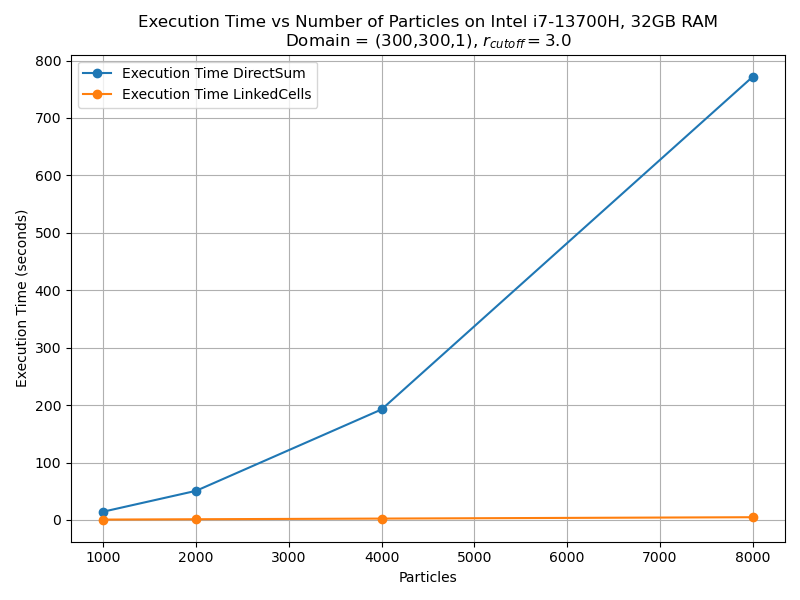

MolSim - Group A
===

Final Assignment

## Dependencies

- Cmake 3.28.3
- Doxygen 1.9.8 (`sudo apt install doxygen`)
- Libxerces (`sudo apt install libxerces-c-dev`)
## Build

### Configuration

- Install

```bash
  git clone https://github.com/jkr11/MolSim.git
``` 

- manual build (I would recommend using make with -j $(nproc) as this is pretty slow)

```bash
  mkdir build
  cmake -S . -B build -<options>
  cd build
  make -j $(nproc)
```

- Testing:

```bash
  cmake -S . -B build -DBUILD_TESTS=ON 
```

To build with Intel's C++ compiler (```icx```/```icpx```), set the following options (currently this is on the [`coolmuc_test`](https://github.com/jkr11/MolSim/tree/coolmuc_test) branch, but it works locally)

```bash
  cmake -S . -B build -DCMAKE_C_COMPILER=icx -DCMAKE_CXX_COMPILER=icpx
```
for other compilers add the necessary compiler id to the options. 
```bash
  cd build/tests
  make -j $(nproc)
  ctest
```

Using the build script in `/script/`

- Build the project using the provided build script by using source, add `-t` to also build and run tests, add `-b` to
  enable the BENCHMARK cmake macro and `-p` to enable OpenMP.

```bash
  cd MolSim/scripts
  source build <CMAKE_BUILD_TYPE= Release (default) | Debug | asan | asan-quiet>  [-t|--test] [-b|--benchmark] [-p|--parallel] 
```

- Set the Input file by selecting the corresponding number during the script execution

```bash
  source set-input
```

- Creating documentation when doxygen is installed (has to be executed in the specific `buildDir/<CMAKE_BUILD_TYPE>`)

```bash
  (cd ../buildDir/<CMAKE_BUILD_TYPE> when starting from /scripts)
  make doc_doxygen 
```

- Running the program

```bash
  $BUILD -f $INPUT <options>
 ``` 

- `$BUILD` contains the location of the last compiled executable
- `$INPUT` contains the location of the selected input file
- Please note that `$BUILD` and `$INPUT` are only available if the scripts are executed via source.

### CMake Options
```console
  - ENABLE_BENCHMARK : enables benchmark mode with no printing of info and writing to files
  - BUILD_TESTS : enables and builds the tests/ directory in the build directory
  - ENABLE_OPENMP : enables OpenMP and support for multithreading
```

### Executable Options

  ```console
  Options:
  --help | -h                     Show this help message
  --file | -f <filename>          Specify the input file
  [--step_size | -s <double>]     Specify how often the output will be written wrt. time(step_size), default=1
                                    Note that this is independent of the time resolution (t_delta) and dependent on the simulation time
  [--loglevel | -l <level>]       Specify the log level, default=info, valid=[off, error, warn, info, debug, trace]
  [--checkpoint | -c <path>]      Specifies the path the final state of the particles will be saved to.
  Example usage:
  $BUILD -f $INPUT -l <loglevel> -s <number>
  ```

- Output is located in `./output/<current_time>`
- Checkpoints as an input have to be explicitely stated in the input ```.xml``` file. I would recommend putting
  checkpoint into `/input/`.
A quick example for checkpointing in Assignment 4 task 3: (in `build/src`)
```bash
  ./MolSim -f ../../input/week43checkpoint.xml -c ../../input/<name_of_your_choice.xml>
  ..... This eventually writes the checkpoint after running ----------
```
the add the following to week43.xml: 
```xml
<checkpoint>
    <name>../../input/<name_of_your_choice.xml></name>
    ...
</checkpoint>
```
and run
```bash
  ./MolSim -f ../../input/week43.xml
```

- `--step_size` is relative to the passed simulation time and not the number of iterations
- `--loglevel debug` is only available if compiled with CMAKE_BUILD_TYPE=Debug
- all other options are specified in the .xml input file
- old inputs have been migrated to xml and support this pipeline

## Parallelization strategies

First, compile with `-DENABLE_OPENMP=ON` to support using OpenMP.

Then, use the xml tag `<use_c18_strategy>` in `<metadata>`, write true to use the c18 travesal, false to use the force
buffer
method or remove the thing entirely to use no parallelization at all (even if this is active). If OpenMP is not used,
this does nothing.

## LinkedCells vs DirectSum performance

### Running benchmark.py

Note this is a remnant from week 3 and 4, but this technically could be rewritten to test 5

For optimal performance run scripts/build with -b for benchmarking
The python script uses the generated executable in buildDir/Release/src for execution.
Ensure you have python 3.6 or later installed

```bash
cd benchmark
python -m vevn <name>
source <name>/bin/activate
pip3 install argparse matplotlib

python3 benchmark.py <options> 
options:
  -h, --help            show this help message and exit
  -a A_VALUES [A_VALUES ...], --a-values A_VALUES [A_VALUES ...]
                        List of 'a' values (multipliers of 1000 particles) to
                        simulate. Default: [1, 2, 4, 8].
  -o OUTPUT, --output OUTPUT
                        Path to save the output plot. Name it graph.png to
                        push it to git.
  -d, --cached-ds       Use default cached execution times for DirectSum
                        instead of running it.
  -s SAMPLES, --samples SAMPLES
                        Number of runs for each a value. Default = 1
  -c, --cubes           Compare three d files to two d files
  -n, --no-ds           Removes direct sum benchmarks from the plot
```

The LinkedCell implementation is more performant than the old DirectSum implementation.


