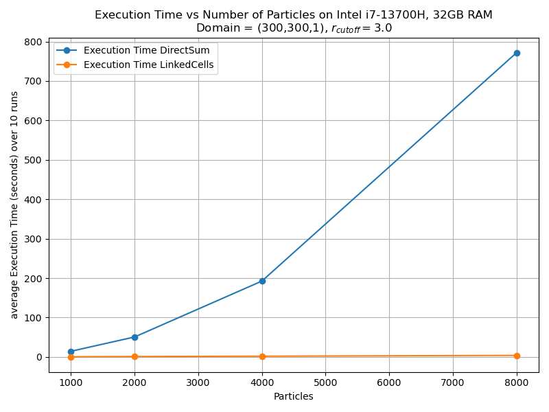

MolSim - Group A
===

## Dependencies
- Cmake 3.10
- Doygen 1.9.8 (`sudo apt install doxygen`)
- Libxerces (`sudo apt install libxerces-c-dev`)

## Build
### Configuration
- Install
  ```bash
  git clone https://github.com/jkr11/MolSim.git
  ```
- Build the project using the provided build script by using source, add `-t` to also build tests
  ```bash
  cd MolSim/scripts
  source build <CMAKE_BUILD_TYPE= Release | Debug | asan | asan-quiet>  [-t]
  ```
- To run tests navigate to the `/buildDir/<CMAKE_BUILD_TYPE>/tests` and run `ctest`

- Creating documentation when doxygen is installed (has to be executed in the specific `buildDir/<CMAKE_BUILD_TYPE>`)
  ```bash
  (cd ../buildDir/<CMAKE_BUILD_TYPE> when starting from /scripts)
  make doc_doxygen 
  ```
- Running the program
  ```bash
  $BUILD <options>
  ``` 
  Please note that `$BUILD` is only available if the script is executed via source and contains the path to the last compiled executable

### Input
To make file input easier, a script `set-input` is provided in `MolSim/scripts/`. Run it using `source set-input` and follow the prompt.
The path is saved in `$INPUT`. Use `$BUILD -f $INPUT` to run.

### Options

  ```console
  Options:
  --help | -h                     Show this help message
  --file | -f <filename>          Specify the input file
  [--step_size | -s <double>]     Specify how often the output will be written wrt. time(step_size), default=1
                                    Note that this is independent of the time resolution (t_delta) and dependent on the simulation time
  [--loglevel | -l <level>]       Specify the log level, default=info, valid=[off, error, warn, info, debug, trace]
  Example usage:
  $BUILD -f $INPUT -l <loglevel> -s <number>
  ```
- Output is located in `./output/<current_time>`
- `--step_size` is relative to the passed simulation time and not the number of iterations
- `--loglevel debug` is only available if compiled with CMAKE_BUILD_TYPE=Debug

## LinkedCells vs DirectSum performance

